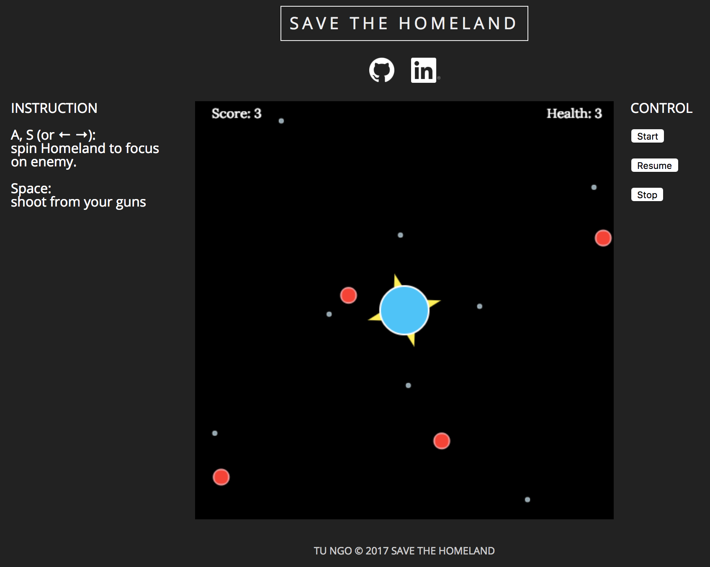

# Save the Homeland

[Live site][live]

[live]: https://tungo.github.io/save-the-homeland

Save the Homeland is a shooting game designed using HTML Canvas and JavaScript.
Player will control the homeland to defend from invaders.

## Instructions

### Gameplay

Game is started with a homeland and guns are attached on it.

Invaders will be spawned random from outside and move forward to homeland.

Player spin homeland clockwise or anticlockwise to focus guns into invaders.
Then fire to destroy invaders.

If invaders hit homeland, the health will be decrease by 1.

Player will be lose if health is 0 and win if score is over 100.

### Control

Press `A` and `S` or `←` and `→` to spin homeland.

Press `Space` to fire.

## Screenshot

## Technologies

This is a front-end project that developed using web technologies:

- HTML Canvas and animation to create a smooth game interface.
- JavaScipt according to Object Oriented principles.
- CSS for the web style.
- Webpack to bundle all files.