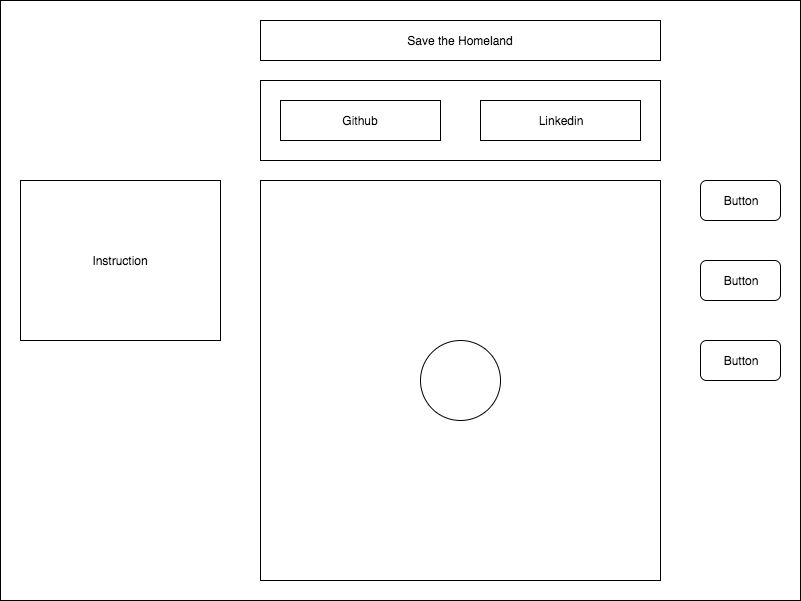

# Save the Homeland

### Background

Save the Homeland is a simple shooter game. Player control the homeland to defend from attackers.

There are some rules:

- Homeland is a circle and can spin around itself only.
- Guns are attached on homeland that can shoot invaders.
- There are some different type of attackers move from outside into homeland.
- Homeland has health and will be lost if attackers hit on homeland.
- Game overs if homeland's health is 0.

### Functionality & MVP

This is single-player game and player will be able to:

- [ ] Start, pause and reset game.
- [ ] Spin homeland to focus guns.
- [ ] Shoot to attacker.
- [ ] Score when destroy attacker.

### Wireframes

Save the Homeland is a single screen app. There are navbar with link to my github and linkedin. The main canvas is at center, with instruction at left side and control buttons in right side.

### Architecture and Technologies

This project will be implemented with the following technologies:

- Vanilla JavaScript and jQuery for overall structure and game logic
- Easel.js with HTML5 Canvas for DOM manipulation and rendering.
- Webpack to bundle and serve up the various scripts.

### Implement Timeline

**Day 1**: Setup webpack and easel.js.
- Setup all node modules with `package.json`.
- Create `webpack.config.js` and entry file.
- Create HTML file and implement `Easel.js` and `jQuery` library.

**Day 2**: Build Game, Objects classes and logic backend.
- Create Game, Homeland, Attacker, Bullet and other classes.
- Implement objects with game logic together.

**Day 3**: Add Control and Implement Object to Game.
- Render objects and game to Canvas and make it work.
- Add Start, Stop, Reset control button.

**Day 4**: Style for the frontend.
- Add CSS, image for objects and game.

### Bonus features

- [ ] Homeland leveling update: health, strength, speed, etc...
- [ ] Boss fight.